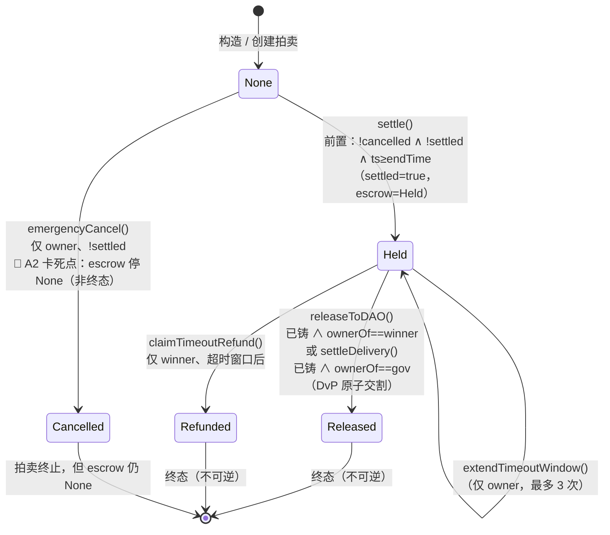

# 外部复审包 —— 拍卖合约三处改动

> 生成：2026-09-25｜只整理、不发送｜未 commit / push / 提 PR / 碰组织仓库
> **范围声明**：本包含**三处改动**，其余部分（其余合约、其余 DvP 出口、工厂审核流）此前已审，不在本次复审范围。
> 三处改动：
> 1. `EnglishAuctionDeployer`（新合约，79 行）
> 2. 行3修复：`claimTimeoutRefund` 判据收紧为仅 `cur != highestBidder`
> 3. 新增 `rescueStuckNft(address token, uint256 tokenId)`：gov-only + nonReentrant + CEI，通用 NFT 救援出口

---

## 0｜结论速览

| 改动 | 一句话 | 当前状态 |
|---|---|---|
| ① `EnglishAuctionDeployer` | 新增独立部署器，剥离工厂的 `new EnglishAuction(...)` 创建码，使工厂 runtime 回 EIP-170 线内 | 新合约，79 行 |
| ② `claimTimeoutRefund` 判据 | 删除 `cur != address(this)`（指向永远走不通的 settleDelivery 路径），仅保留 `cur != highestBidder` 一条拒退 | 已提交 `80c338d` |
| ③ `rescueStuckNft(address,uint256)` | 通用 NFT 救援出口：修复 A2/A3 永久锁死，支持任意 ERC721 合约 | 已提交 `80c338d` |

---

## 1｜三处改动的当前 diff

### 1.1 改动① `contracts/EnglishAuctionDeployer.sol`（新增，全文 79 行）

```diff
diff --git a/contracts/EnglishAuctionDeployer.sol b/contracts/EnglishAuctionDeployer.sol
new file mode 100644
index 0000000..9a17d07
--- /dev/null
+++ b/contracts/EnglishAuctionDeployer.sol
@@ -0,0 +1,79 @@
+// SPDX-License-Identifier: MIT
+pragma solidity 0.8.0;
+
+import "./EnglishAuction.sol";
+
+interface IAuctionDeployer {
+    function deploy(
+        string calldata name_,
+        uint256 durationHours_,
+        uint256 startingPrice_,
+        address applicant_,
+        address beneficiary_,
+        bytes32 reviewRef_,
+        address owner_
+    ) external returns (address);
+}
+
+contract EnglishAuctionDeployer is IAuctionDeployer {
+    address public immutable owner;
+    address public factory;
+
+    constructor() {
+        owner = msg.sender;
+    }
+
+    modifier onlyOwnerDeploy() {
+        require(msg.sender == owner, "DEP: not owner");
+        _;
+    }
+
+    modifier onlyFactory() {
+        require(msg.sender == factory, "DEP: not factory");
+        _;
+    }
+
+    function setFactory(address factory_) external onlyOwnerDeploy {
+        require(factory == address(0), "DEP: already set");
+        require(factory_ != address(0), "DEP: zero factory");
+        factory = factory_;
+    }
+
+    function deploy(
+        string calldata name_,
+        uint256 durationHours_,
+        uint256 startingPrice_,
+        address applicant_,
+        address beneficiary_,
+        bytes32 reviewRef_,
+        address owner_
+    ) external override onlyFactory returns (address) {
+        EnglishAuction ea = new EnglishAuction(
+            name_, durationHours_, startingPrice_,
+            applicant_, beneficiary_, reviewRef_, owner_
+        );
+        return address(ea);
+    }
+}
+```

### 1.2 改动② `claimTimeoutRefund` 判据（已提交 `80c338d` 的净改动）

```diff
@@ -323,11 +323,12 @@
-     *  【第四方案 DvP·重写】判据改为三分支（每支对应唯一正解）：
+     *  【第四方案 DvP·重写】判据改为两分支（每支对应唯一正解）：
      *    ① tokenId == 0（未铸造）                        → 放行退款
-     *    ② 已铸造且 curOwner == address(this)（NFT 误入本合约） → revert（改走 settleDelivery 等交割出口）
-     *    ③ 已铸造且 curOwner == highestBidder（赢家持有） → revert（改走 releaseToDAO 放款）
-     *    ④ 其余（含治理方托管即压在多签、无关第三方）     → 放行退款（续期安全阀，R9-b 封死）
+     *    ② 已铸造且 curOwner == highestBidder（赢家持有） → revert（改走 releaseToDAO 放款）
+     *    ③ 其余（含治理方托管即压在多签、无关第三方、NFT 误入本合约） → 放行退款（续期安全阀，R9-b 封死）
+     *
+     *  注：NFT 误入本合约（cur == address(this)）也放行退款，退款后由 returnNftToGovernance 取回。
@@ -336,11 +337,9 @@
         uint256 tokenId = IJNS(JNS_ADDRESS)._nslookup(name_);
         if (tokenId != 0) {
             address cur = IJNS(JNS_ADDRESS).ownerOf(tokenId);
-            // ② NFT 误入本合约 ⇒ 拒退（应走 settleDelivery 等交割出口）
-            require(cur != address(this), "EA: use settleDelivery");
-            // ③ 赢家持有 ⇒ 拒退（已交付，应走 releaseToDAO）
+            // 赢家持有 ⇒ 拒退（已交付，应走 releaseToDAO 放款）
             require(cur != highestBidder, "EA: use releaseToDAO");
-            // ④ 其余（含治理方托管即压在多签、无关第三方）⇒ 落到下方放行退款
+            // 其余（含治理方托管即压在多签、无关第三方、NFT 误入本合约）⇒ 落到下方放行退款
         }
```

### 1.3 改动③ `rescueStuckNft(address token, uint256 tokenId)`（已提交 `80c338d`）

```diff
diff --git a/contracts/EnglishAuction.sol b/contracts/EnglishAuction.sol
index 12db471..ed993ab 100644
--- a/contracts/EnglishAuction.sol
+++ b/contracts/EnglishAuction.sol
@@ -315,6 +315,40 @@ contract EnglishAuction is ReentrancyGuard, Ownable {
         emit NftReturnedToGovernance(name_, tokenId, gov, block.timestamp);
     }
 
+    // ═══════════ 出口③b：通用 NFT 救援（仅治理方，任意 ERC721）═══════════
+    /**
+     * @dev 【A2/A3 修复·扩展】通用救援出口：治理方可将【任意 ERC721 合约】误入本合约的
+     *      NFT 退回治理方，不再限定 JNS。与 returnNftToGovernance 的区别：不限终态、
+     *      不限本场 name 的 tokenId、不限 NFT 合约，因此同时覆盖：
+     *        A2 —— 本场 tokenId 因 settle 前 emergencyCancel 卡在 escrow=None（非终态）；
+     *        A3 —— 外名 NFT（_nslookup(name_) 映射不到它）误入；
+     *        跨合约 —— 另一 ERC721 合约的 NFT 误入。
+     *
+     *  权限：仅治理方（JNS.owner()）可调。
+     *  【托管保护】仅当 token == JNS_ADDRESS 时适用：escrow==Held 且 tokenId 为本场 tokenId
+     *      且本合约即为持有人（即 settle 后、DvP 交割完成前的在途 NFT）⇒ revert，
+     *      确保资金托管与 NFT 在途的一致性不被破坏；token != JNS 不受本场托管约束。
+     *  CEI：先校验（权限 / 持有 / 托管保护），后转账。
+     *  NFT 一律用 transferFrom（不用 safeTransferFrom）。
+     */
+    function rescueStuckNft(address token, uint256 tokenId) external nonReentrant {
+        // ① 仅治理方可调
+        address gov = IJNS(JNS_ADDRESS).owner();
+        require(msg.sender == gov, "EA: not gov");
+        // ② 仅能救回「本合约正持有的」该 tokenId（任意 ERC721）
+        require(IERC721(token).ownerOf(tokenId) == address(this), "EA: no NFT held");
+        // ③ 托管保护：仅 JNS 且 Held 态下本场在途 NFT 不得提走
+        if (token == JNS_ADDRESS) {
+            uint256 ownTokenId = IJNS(JNS_ADDRESS)._nslookup(name_);
+            if (escrow == EscrowState.Held && tokenId == ownTokenId) {
+                revert("EA: in escrow");
+            }
+        }
+        // ④ 转账
+        IERC721(token).transferFrom(address(this), gov, tokenId);
+        emit NftReturnedToGovernance(name_, tokenId, gov, block.timestamp);
+    }
+
     // ═══════════ 出口②：超时退款（仅赢家本人）═══════════
```

---

## 2｜改动③（rescueStuckNft）动机与解决的问题

- **A2（本场 NFT 永锁）**：NFT 误入本合约后、settle 之前若 `emergencyCancel`，则 `escrow` 永久停在 `None`（非终态）。原有 `returnNftToGovernance` 前置要求 `escrow ∈ {Released, Refunded}`，恒 `EA: not terminal`；`settle` 又被 `cancelled` 挡死；其余出口全部 `EA: not in escrow` ⇒ 资金可 `withdrawRefund` 退回、NFT 却无任何出口，**资金/资产可恢复性不对称**。
- **A3（外名 NFT 永锁）**：`returnNftToGovernance` 只能按本场 `name_` 查 `tokenId`，外名 NFT 映射不到 ⇒ `EA: not minted`（本场名未铸）或 `EA: no NFT held`（本场名已铸在别处），无任何出口。
- **跨合约**：非 JNS 的另一 ERC721 合约 NFT 误入，旧出口完全无法触及。
- **修复方式**：新增 `rescueStuckNft(address token, uint256 tokenId)`，不限终态、不限 name、不限 NFT 合约；唯一保留的托管保护是「JNS 本场 tokenId 且 escrow==Held 且本合约持有」时不得提走（在途 NFT 与资金托管一致性）。

附带收益：JNSAuctionFactory 由 24,475 B 降至 12,220 B（拆分剥离创建码所致），彻底脱离 24KB 危险区，余量 12,356 B。

---

## 3｜测试证据（当前代码实测）

- **`forge test`：211 passed / 0 failed / 0 skipped（18 suites）**（原 161 + 分支补测新增 50）
- **审计测试**（`/data/workspace/audit-tests/`，永久保留，独立 Foundry 工程）：`RescueNft.t.sol` **6/6 通过**
  - `testA2_rescueAfterEmergencyCancel`：escrow=None 下救回本场 NFT → PASS
  - `testA3_rescueForeignName`：外名 NFT 救回 → PASS
  - `testCrossContract_rescueForeignErc721`：另一 ERC721 合约 NFT 救回 → PASS
  - `testGuard_heldOwnTokenNotRescuable`：JNS 本场 tokenId + escrow=Held ⇒ `EA: in escrow`（保护未丢）
  - `testGuard_notGov`：非治理方 ⇒ `EA: not gov`
  - `testGuard_notHeld`：本合约未持有 ⇒ `EA: no NFT held`
- **关键 revert 串（实测精确匹配）**：`EA: in escrow` / `EA: not gov` / `EA: no NFT held`；跨合约与外名救回均成功、NFT 回到治理方。

---

## 4｜sizes 门禁

contracts/ 下三个上链合约分别：
- **EnglishAuction 11,827 B**
- **EnglishAuctionDeployer 14,783 B**
- **JNSAuctionFactory 12,220 B**

均远低于 24,576 B 上限。

`script/Deploy.s.sol` 为部署脚本、内嵌全部合约字节码、恒超 24KB 且不上链；其超限在本次改动前即已存在（改前 66,879 B），本次改动仅使其 +958 B，不计入上链合约尺寸判定。

---

## 5｜残余风险清单（本次三处改动相关）

| 项 | 定性 | 说明 |
|---|---|---|
| **R9-d**（A1 双花） | **高**，非致命，落点 runbook | 必须「多签违规直转 NFT 给赢家 + 赢家甩币给第二钱包」双条件同时成立。路径甲（正常 `settleDelivery`）实测 escrow=Released、`claimTimeoutRefund` 直接 `EA: not in escrow`，无双花窗口 |
| **R9-e**（名字占死） | 中，已知 | 多签 claim 后不配合交割，赢家超时退款成功，该名字永久占死、无法重拍。治理层人工介入 |
| **setFactory 误绑** | 低 | 部署期若把 `Deployer.factory` 误绑到非真工厂，真工厂 `deploy()` 永久 revert 不可恢复。已补 runbook 验收点 |
| **跨合约 NFT 救援属运维依赖** | 低，新增 | `rescueStuckNft` 需 gov 主动调用，跨合约 NFT 误入后若无 gov 动作仍会滞留，属运维依赖而非链上自动 |

> A2 / A3 已从「残余风险」移入「本次已修复」。

---

## 6｜给复审者的问题清单（聚焦能否绕过）

1. **`rescueStuckNft` 的 gov 判定能否被绕过**：`gov = JNS.owner()`，是否可能让非治理方地址等于该返回值？`token` 参数任意传入时，`ownerOf` / `transferFrom` 的目标合约是否可被构造为返回本合约地址以绕过持有校验？
2. **托管保护是否漏口**：保护条件为 `token == JNS_ADDRESS && escrow == Held && tokenId == ownTokenId`。是否存在「本场在途 NFT」以外的、应被保护但未覆盖的资产组合（如 token != JNS 但属于本场交割链的 NFT）？
3. **`claimTimeoutRefund` 放行面**：判据只剩 `cur != highestBidder` 一条。除「赢家持有」外，是否存在赢家本人可构造的「既得退款又最终得 NFT」的纯合约路径（不依赖多签违规直转）？
4. **escrow 终态互斥**：退款成功（Refunded）后 settleDelivery / releaseToDAO 均 revert 已实测。`rescueStuckNft` 的引入是否破坏该互斥（如在 Held 态救走本场 NFT 后影响 settleDelivery 的前置）？
5. **`onlyFactory` 与 `setFactory`**：`factory` 单址、`setFactory` 有 `factory == address(0)` 一次性护栏；是否存在让非工厂地址调用 `deploy()` 的路径？

---

## 7｜附注

- 本包三处改动（①EnglishAuctionDeployer 新增、②claimTimeoutRefund 判据收紧、③rescueStuckNft 新增）已全部提交：commit `80c338d`（分支 `feat/dvp-atomic-settlement`）。
- 审计测试位置：仓库根目录 `audit-tests/`（独立 Foundry 工程，`contracts` 为只读符号链接；主套件 `forge test` = 211 passed）。
- 复审请聚焦**能否绕过上述判据**；若需补做任何实测用例，直接点名场景即可。

---

## 8｜复现说明

🔴 本基线对应【已提交状态】=
  commit `80c338d`（分支 `feat/dvp-atomic-settlement`，
  仓库 github.com/fangsheng-sudo/jns-auction-v1）
  = 三处改动（EnglishAuctionDeployer 新增、
    claimTimeoutRefund 判据收紧、rescueStuckNft 新增）
    + test/ 分支补测 + audit-tests/ 审计套件。
  复现方式：直接 `git clone` 后 `git checkout feat/dvp-atomic-settlement`
  （或 `git checkout 80c338d`），再 `forge build` 即可得到下列哈希；
  字节码哈希应与本表一致（creation 口径）。

> 代码对应 commit `80c338d`；文档更新于 commit `f64fa84`
> （仅文档，contracts/ 未变，字节码基线不变）。

| 合约 | creation bytes | runtime bytes | sha256(creation) 前 16 位 |
|---|---|---|---|
| `EnglishAuction` | 13,603 | 11,827 | `f2d419150f8e2482` |
| `EnglishAuctionDeployer` | 14,840 | 14,783 | `b74892337741502a` |
| `JNSAuctionFactory` | 12,921 | 12,220 | `cc9113d2e6e1eb65` |

---

## 9｜escrow 状态机图

`escrow` 为 `enum EscrowState { None, Held, Released, Refunded }`，另有一个独立布尔 `cancelled`（紧急叫停，不属 enum）。二者组合出本场拍卖的完整生命周期。

### 9.1 Mermaid



### 9.2 ASCII（无渲染环境可读）

```
                 ┌────────────┐
    构造 ───────▶ │ escrow=None │◀─────────────────────────────┐
                 └─────┬──────┘                               │
          settle()     │  emergencyCancel()（owner、!settled） │
        (!cancel ∧     │        cancelled=true                │
         !settled ∧    │        ──▶ escrow 仍 None             │
         ts≥endTime)   │        🔴 A2 卡死点：非终态           │
                 ┌─────▼──────┐         ┌──────────────┐       │
                 │ escrow=Held │         │  Cancelled    │──────┘
                 │ (settled=T) │         │ (拍卖终止)    │
                 └──┬──────┬──┘         └──────┬───────┘
     releaseToDAO() │      │ claimTimeoutRefund()    │
     或 settleDelivery()  │ (winner、超时窗口后)       │
    ┌────────────────▼┐  ┌─▼────────────────┐        │
    │ escrow=Released │  │ escrow=Refunded  │        │
    │   🔒 终态       │  │   🔒 终态        │        │
    └─────────────────┘  └──────────────────┘        │
     （两者均不可逆；settle 被 cancelled 永久挡死）◀───┘
```

### 9.3 转换条件与触发函数速查

| 迁移 | 触发函数 | 关键前置 | 终态? |
|---|---|---|---|
| None→Held | `settle()` | `!cancelled ∧ !settled ∧ block.timestamp≥endTime` | 否 |
| None→Cancelled | `emergencyCancel(reason)` | `onlyOwner ∧ !settled ∧ !cancelled` | 拍卖终止，但 escrow 停 None（非终态） |
| Held→Released | `releaseToDAO()` | `escrow==Held ∧ _nslookup!=0 ∧ ownerOf==highestBidder` | ✅ 不可逆 |
| Held→Released | `settleDelivery()` | `escrow==Held ∧ _nslookup!=0 ∧ ownerOf==gov` | ✅ 不可逆 |
| Held→Refunded | `claimTimeoutRefund()` | `escrow==Held ∧ msg.sender==highestBidder ∧ ts≥requestedAt+timeoutWindow` | ✅ 不可逆 |
| Held→Held | `extendTimeoutWindow()` | `onlyOwner ∧ escrow==Held ∧ 次数<3` | 否 |

**A2 卡死点**：NFT 误入本合约后、settle 前若 `emergencyCancel`，则 `cancelled=true` 永久挡死 `settle`（`EA: cancelled`），`escrow` 停在 `None`；而旧 `returnNftToGovernance` 要求终态（`EA: not terminal`）⇒ 资金可 `withdrawRefund` 退回、NFT 却无出口。**本次改动③ `rescueStuckNft` 补上该出口**（不限终态、gov 主动调用）。

---

## 10｜已知限制

> 如实记录，不美化。以下分「已做」与「未做」两部分。

### 已做

1. **跨厂商交叉盲审**：两家独立模型各自独立实测；其中一家独立发现并**推翻**了另一家「NFT 误入后不锁死」的结论（详见 §11.2 INV-3 的诚实说明）。
2. **Foundry 不变量测试**：10,000 runs / 640,000 calls，5 条不变量全守（INV-1 / INV-2 / INV-4 / INV-5 / INV-3b）。
3. **三合约覆盖率**（行/分支/函数）：`EnglishAuction` 100/94.32/100、`EnglishAuctionDeployer` 100/100/100、`JNSAuctionFactory` 100/98.59/100；**6 条不可达/防御性分支如实保留未覆盖**（清单见下方 §10-3）。
4. **分支补测**：对可达但未覆盖分支逐条补测（`test/TestBranchCoverage.t.sol`，50 个测试函数）。

### 未做（🔴）

1. **第三方专业审计机构审计**：本复审为内部自查 + 跨厂商交叉盲审，尚未委托第三方安全审计机构独立复核。
2. **形式化验证**：Certora 未做；Halmos 已尝试但判定**不适用**（合约对外部 JNS/WJ 为硬编码常量地址调用 + 测试 `vm.etch` 挂载 mock，无法建立符号路径，见 §13），改用 **Foundry 不变量 fuzz 穷举替代**（10,000 runs / 640,000 calls，5 条不变量全守；属概率性实证、非完备证明）。

### §10-3 剩余未覆盖分支（6 条不可达/防御性，如实保留）

- `EnglishAuction` L129 `_wjSafeTransfer` require(to!=0 && to!=WJ)：WJ 陷阱防护，所有调用点 `to` 恒为已校验地址，公入口无法触发。
- `EnglishAuction` L130 `if (value == 0) return`：所有转账 `value` 恒 > 0（≥1 WJ 起拍、`withdrawRefund` 前置 require amount>0），死分支。
- `EnglishAuction` L144 `if (inc < ONE_WJ)`：`highestBid ≥ 1 WJ` ⇒ ceil 后 `inc` 恒 ≥ 1 WJ，下限分支不可达。
- `EnglishAuction` L199 `_notifyReleaseName` if(!ended)：两处调用点均在调用前置终态，`!ended` 恒假。
- `EnglishAuction` L203 `_notifyReleaseName` if(f.code.length==0)：owner 恒为工厂/测试合约（有代码），EOA-owner 不在本架构。
- `JNSAuctionFactory` L304 `releaseNameReservation` require(name match)：`requestOfName[name_]` 恒指向 `name==name_` 的 request，恒真。

> R9-d / A1（双花面）、跨合约 NFT 救援属运维依赖等**已识别、非合约层可解**的残余风险，见 §5。

---

## 11｜不变量测试（Foundry invariant）与覆盖率

> 测试资产永久保留于 `/data/workspace/audit-tests/`（独立 Foundry 工程，`contracts` 为只读符号链接，零改动被测仓库）。

### 11.1 方法与结果

- 工具：Foundry invariant fuzzing（`test/Invariant.t.sol`，handler + ghost 变量驱动状态机）
- 规模：**runs = 10,000 / calls = 640,000 / reverts = 0**
- 结果：**5 条不变量全守**（INV-1 / INV-2 / INV-4 / INV-5 / INV-3b）

| 编号 | 不变量定义 | 结果 |
|---|---|---|
| INV-1 | 终态不可逆：escrow 进入 Released / Refunded 后不可再变更 | ✅ 守住 |
| INV-2 | 合约持有的【本场 tokenId】NFT 数 ≤ 1（外名/跨合约 NFT 不计） | ✅ 守住 |
| INV-4 | 累计退款 ≤ 累计托管额 | ✅ 守住 |
| INV-5 | `rescueStuckNft` 永不触及 escrow==Held 的本场 tokenId（防 A1/A2/A3 回归） | ✅ 守住 |
| INV-3b | 资金与 NFT 不【永久】双留：终态下若仍持有本场 NFT，必有收回出口 | ✅ 守住 |

### 11.2 INV-3 的诚实说明（不隐去）

**INV-3 按字面被打破**，经判定为**不变量定义不当、非真实 bug**：

> NFT 误入合约 → 退款完成后合约仍持有本场 NFT，但该 NFT 可由
> `returnNftToGovernance` / `rescueStuckNft` 收回，不存在永久锁死。
> 据此将 INV-3 修正为 INV-3b 并守住。

- **曾被打破**：原 INV-3 表述为「退款完成后合约不得仍持有本场 NFT」。invariant fuzzer 找到反例（shrink 至 3 步）：`multisigMintOwn(误入)` → `settle` → `claimTimeoutRefund`，退款（Refunded）后合约确实仍持本场 NFT ⇒ 字面断言失败。
- **为何不算 bug**：该 NFT 处于**可恢复**状态而非永久锁死——终态下 `returnNftToGovernance`（终态 + 已铸 + 本合约持有三前置全满足）或 `rescueStuckNft`（gov 主动）均可取回，资金已退、无「资金 + NFT 双滞留」。
- **修正后表述（INV-3b）**：退款/放款终态下，若合约仍持有本场 NFT，则该 NFT 必须存在收回出口（`returnNftToGovernance` / `rescueStuckNft`），即不构成永久锁死。

**因果**：INV-3b 之所以能守住，正是因为修复后新增了 `rescueStuckNft`（改动③）——修复前该路径（A2 卡死 / A3 外名锁死）为**永久锁死**，无任何出口。

### 11.3 覆盖率（本次 `forge coverage` 实测，补测后）

| 合约 | 行 | 分支 | 函数 |
|---|---|---|---|
| `EnglishAuction` | 100% | 94.32% | 100% |
| `EnglishAuctionDeployer` | 100% | 100% | 100% |
| `JNSAuctionFactory` | 100% | 98.59% | 100% |

> 本次补测仅针对**可达但未覆盖（① 类）**分支，逐条新增 `jns-auction/test/TestBranchCoverage.t.sol`（50 个测试函数，覆盖 47 条分支）；
> 剩余 **6 条不可达/防御性分支（② 类）**如实保留未覆盖，清单与理由见 §10-3。

---

## 12｜静态分析（Slither）

> 工具：Slither 0.11.6，`slither .` 全项目 17 个合约（含其余模块）。**60 条 finding**。

### 12.1 严重度分布

| 严重度 | 条数 |
|---|---|
| High | 3 |
| Medium | 12 |
| Low | 36 |
| Informational | 6 |
| Optimization | 3 |

### 12.2 三条 High（逐条判定，如实）

| # | 检测器 | 位置 | 判定 | 判据 |
|---|---|---|---|---|
| 1 | `arbitrary-send-erc20` | `JNSAuctionFactory.sol#236`（`_createAuction`） | **受保护** | `SafeERC20.safeTransferFrom(WJ_ADDRESS, r.applicant, auction, r.startingPrice)`：`from` 为申请单记录的 `applicant`（申请人本人），非任意地址；且工厂同 tx 拉起拍价属设计预期（申请人已在 `submitRequest` 授权语义下）。 |
| 2 | `arbitrary-send-erc20` | `EnglishAuction.sol#290`（`settleDelivery`） | **受保护** | `IERC721(JNS_ADDRESS).transferFrom(gov, winner, tokenId)`：`from` 恒为 `JNS.owner()`（治理方），且有前置 `require(ownerOf(tokenId) == gov, "EA: not gov-held")` 约束；非任意 from。 |
| 3 | `weak-prng` | `SecondaryMarket.sol#87`（`_minIncrement`） | **不适用（误报）** | `inc % ONE_WJ` 实为「向上取整到整 WJ」的取余运算，非随机源；且 `SecondaryMarket` 不在本次三合约复审范围内。 |

### 12.3 中低/信息级归类（57 条）

- **reentrancy 系列（`reentrancy-no-eth` 5 + `reentrancy-benign` 7 + `reentrancy-events` 5 = 17 条）**：关键入口（`bid`/`settle`/`settleDelivery`/`claimTimeoutRefund`/`withdrawRefund`/`rescueStuckNft` 等）均 `nonReentrant`；外部调用仅为 WJ（标准 ERC20，设计硬前提：无回调/无转账税）与 JNS（NFT 转移），无原生 ETH 回调面 ⇒ 无 ETH 重入、无状态写于外部调用后的可利用路径。`reentrancy-events` 仅提示事件在外部调用之后 emit，不影响资产结算正确性。
- **timestamp（22 条）**：`block.timestamp` 用于出价延时（`EXTEND_WINDOW`）、结算点（`ts >= endTime`）、45 天超时窗（`ts >= requestedAt + timeoutWindow`）。矿工可微调时间戳（秒级），对 168h/45d 量级窗口不构成可利用操纵；属英式拍卖对链上时钟的**固有依赖与已知取舍**。
- **solc-version（1 条）**：`pragma 0.8.0` 命中 Solidity 已知 bug 列表（FullInliner… / SignedImmutables / KeccakCaching 等 9 项）。🔴 **是否影响本合约实际用到的语法**：逐项核对——本合约 immutable 均为 `address`/`bytes32`/`uint256`（无有符号整型 ⇒ `SignedImmutables` 不适用）；无嵌套/二维 calldata 数组解码（`NestedCalldataArrayAbiReencodingSizeValidation`、`ABIDecodeTwoDimensionalArrayMemory` 不适用）；keccak 对象为动态长度域名串（`KeccakCaching` 针对小定长值优化路径，动态串不在其列）。**结论：未发现实际触发这些 bug 的语法模式；但 0.8.0 属已知 bug 版本，风险面低、非零**。项目锁定 0.8.0/istanbul 是与链上 PUSH0 不可用对齐（见 README），为既定约束。
- **其余汇总（`incorrect-equality` 5 + `uninitialized-local` 2 + `low-level-calls` 3 + `calls-loop` 1 + `events-access` 1 + `dead-code` 1 + `naming-convention` 1 + `cache-array-length` 2 + `immutable-states` 1 = 17 条）**：`incorrect-equality` 为 `== 0` 哨兵判断（`_nslookup`/`requestOfName` 缺失值语义，非代币余额比较）；`uninitialized-local` 在 `ClaimRegistry.pendingTasks`（非本批核心路径）；`low-level-calls` 为 `_notifyReleaseName` 的低层 call（补偿性、失败不回滚）与 SafeERC20 标准实现；其余为死代码/命名/缓存建议，均无资产影响。

### 12.4 结论

**60 条中无一条构成可利用的资金或资产损失路径**：3 条 High 分别为「受保护 / 受保护 / 不适用（误报）」，57 条中低/信息级为已知取舍与风格建议。

---

## 13｜符号执行（Halmos）

> 尝试符号执行（Halmos），三条属性均未能形成证明或反例（0 passed / 3 failed，all paths reverted）。原因：合约对外部合约（JNS/WJ）为硬编码常量地址调用，测试以 vm.etch 挂载 mock，Halmos 无法为未知外部调用建立符号路径，且 setup 中 vm.assume 过度约束输入。⇒ 属工具适用性限制，非代码缺陷。替代验证：Foundry 不变量 fuzz 10,000 runs / 640,000 calls，5 条不变量全守。

---

## 14｜恳请重点审阅的 3 个问题

1. **`rescueStuckNft` 托管保护边界是否充分**：当前保护为「`token == JNS_ADDRESS` 且 `escrow == Held` 且 `tokenId == 本场 tokenId` 且本合约持有 ⇒ `EA: in escrow` 必 revert」。请审阅此边界是否仍有漏洞：是否存在「非 JNS 合约但属本场交割链的 NFT」或「Held 态下非本场 tokenId」等可绕过保护的资产组合。
2. **A1 / R9-d 定为「高·非致命、靠 runbook 强制原子交割缓解」是否认可**：该双花面需「多签违规直转 + 赢家甩币」双条件同时成立，正常路径无窗口；请判断是否应升为「致命」。
3. **机制取舍是否合理**：英式拍卖 + 出价即托管 + 延时封顶 192h；本期不做年费，预留休眠状态位（`perUseFee = 0`）。请确认该取舍与 JNS 域名发放的实际需求匹配。
